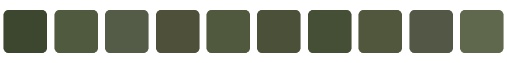
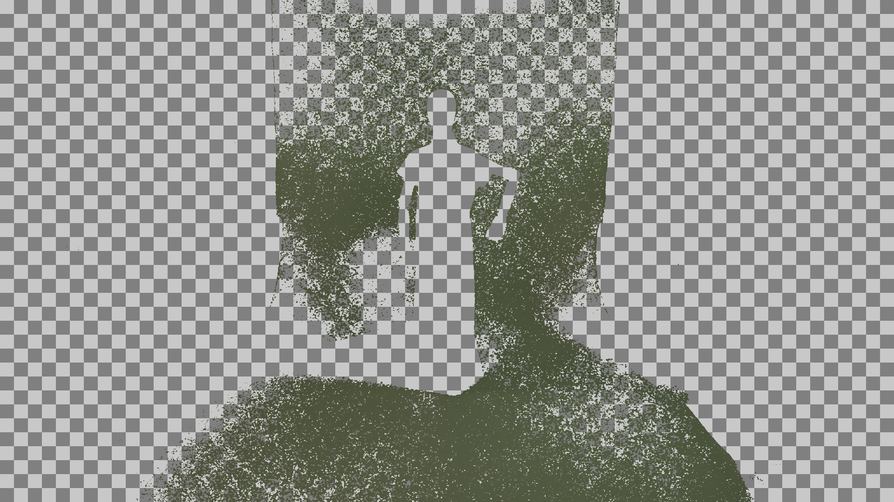
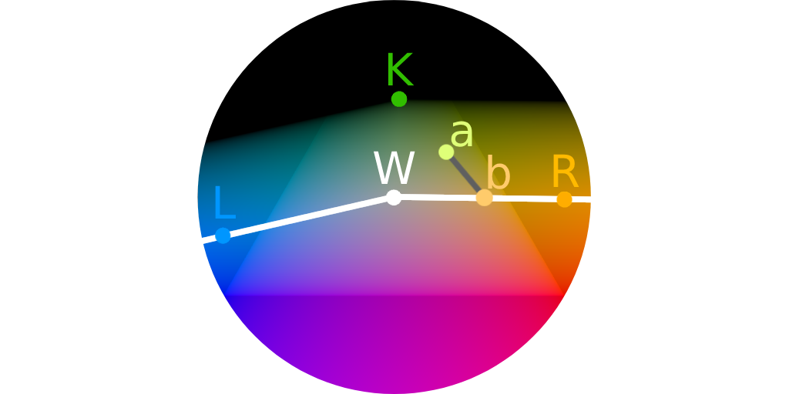
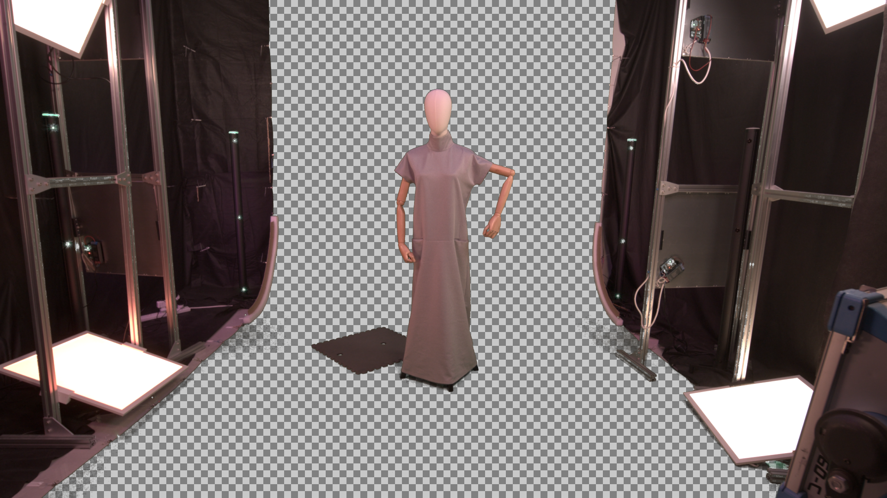
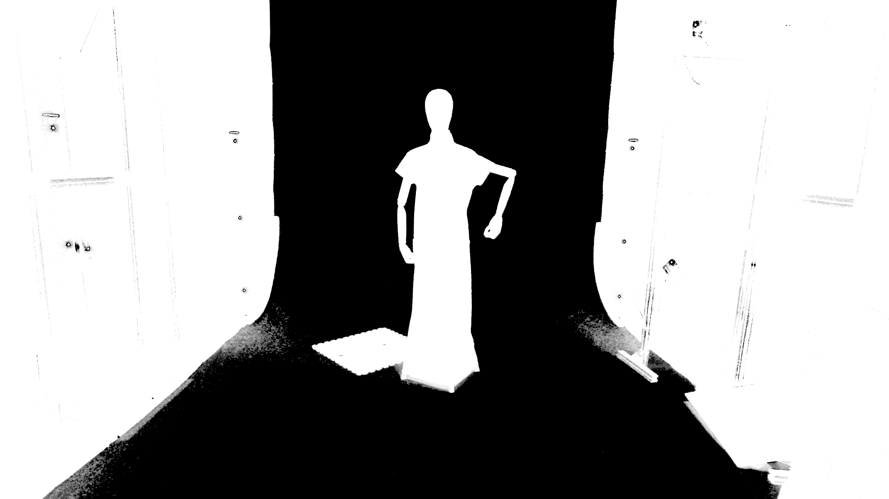

# K0 Keying Algorithm Overview

## Input

The K0 keyer takes an input image:

## Color Picking

Background colors can be selected manually, or a color array can be provided by CyberGaffer.

## Color Search

All background colors and their interpolations are found in the input image.

## Background Infill

The remaining areas in the image are filled by propagating the nearest known background color. This produces a clean, complete background image:

## Surface Adjustment

Inside the RGB color cube, a surface is defined using the colors **W**, **L**, **R**, and black.

- Colors *below* this surface are considered valid (allowed colors) and remain unchanged.
- Colors *above* the surface are interpreted as a mixture of a background color (**K**) and one of the allowed colors.

The algorithm estimates the original foreground color and calculates its presence in the mixture as **alpha**.

For example, a color **a** is transformed into color **b** with an alpha of `0.52`.

Users can adjust the surface by modifying the **W**, **L**, and **R** colors. This helps eliminate edge artifacts and results in more accurate color recovery.

## Output

Final results of the keying process:

**Recovered Foreground**  

**Alpha Channel**  

## Quality Check

Keying quality is assessed by compositing the result onto solid black and white backgrounds. Color restoration errors become most visible in these conditions:

**On White**  

**On Black**  

