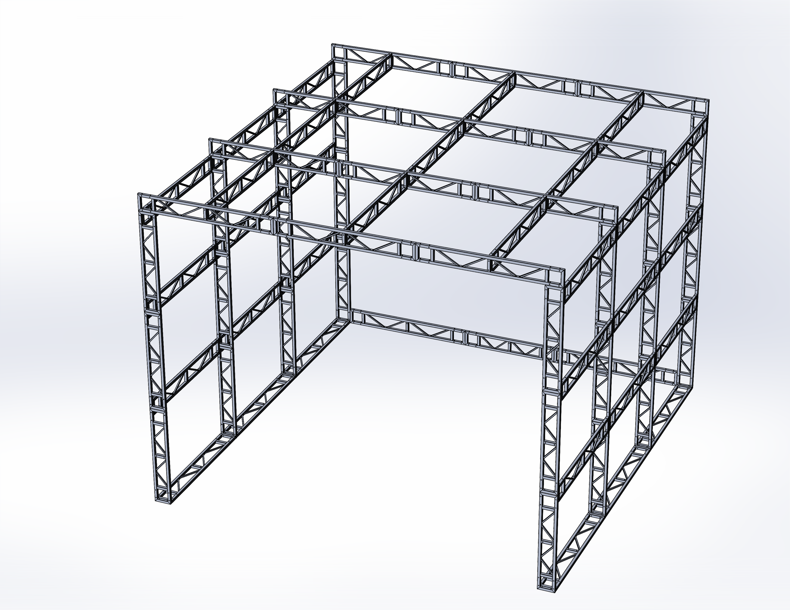
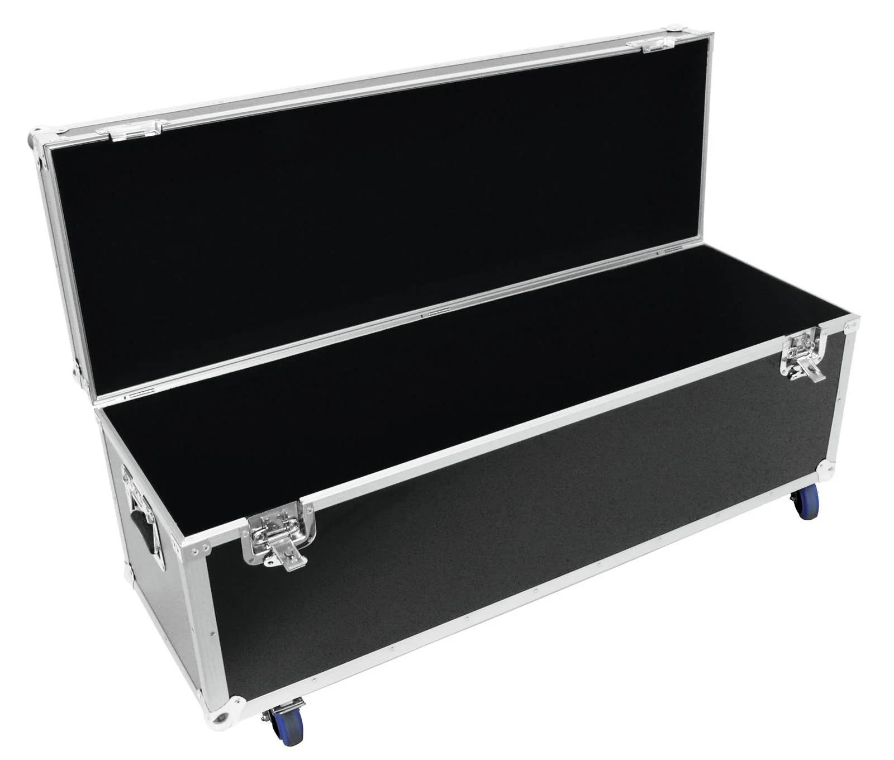

# Mechanical Design Overview

## Studio Specifications

- **Dimensions**: 6m x 6m x 4.5m – compact and modular.

- The studio **packs into transportation cases** and is **delivered ready-to-assemble** to the customer.

- **Exterior**: Blackout fabric for full light control.
- **Interior**: Matte, non-reflective green screen fabric; comes with **two interchangeable backdrops**.
- **Antilatency Tracking System**: Custom vertical pillars with IR markers are mounted on the trusses.
- **Lighting**: Kit of lightweight light fixtures mounted on the trusses.
- **Optional Add-on**: Front-facing camera rail system.

## Exhibition Advantages

- In addition to being a **modular VP studio**, the solution also serves as a **fully equipped exhibition booth**—ideal for trade shows and industry events.
- The studio’s **6 × 6 × 4.5 m** footprint fits perfectly within **standard exhibition booth sizes**, making it easy to deploy at most venues.
- Enables a **complete, real-time demonstration** of the virtual production workflow in **just 20 minutes**.
- Visitors experience the **entire process**—from setup to final composited output—in a **compact, interactive, and visually engaging format**.

