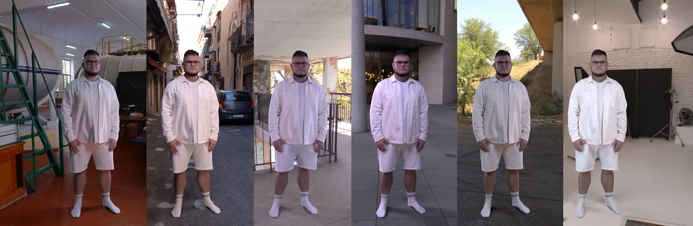

[Home](https://antilatency.github.io/GreenScreenStudioConcept) |
[Light fixture](Light/README.md) |
[Mechanical Design](MechanicalDesign/README.md) |
[Keyer](K0/README.md) |
[VP App](VPApp/README.md)

# Virtual Production Studio by Antilatency

Antilatency is launching a new product — a professional virtual production studio, ready to use out of the box with minimal setup. Designed for rapid deployment, the studio requires no more than **2 days from delivery to first shoot**.

The main goal of the project is to **lower the entry barrier** to virtual production while delivering **exceptional out-of-the-box quality**.

Here’s the set of elements that makes this possible.

## Mechanical Design
The client will receive structural elements for assembling a 6×6×4.5 meter studio, including:
- Custom-designed flat aluminum trusses
- Two sets of chroma key fabric backdrops for uninterrupted operation (no waiting for cleaning)
- Blackout fabric for the exterior shell

[Learn more](MechanicalDesign/README.md)

## Next-Gen Light fixtures

24 lightweight, high-fidelity LED lights engineered by Antilatency specifically for VP.
Includes all required reflective panels for directional control and pre-cut Power-CON and Ethernet cables for a plug-and-play setup.
[Learn more](Light/README.md)

## CyberGaffer

CyberGaffer delivers the most precise real-world approximation of virtual scene lights in a physical studio through advanced mathematical calculations and calibration techniques.
[Learn more at CyberGaffer.com](https://cybergaffer.com/)

## Antilatency Camera Tracking and Lens Calibration
Integrated with our brand-new **TrackedVideo technology** — a breakthrough in tracking data synchronization.

TrackedVideo encodes tracking data directly into the camera’s audio line-in. This ensures perfect sync with the video feed at all times, regardless of transmission pipeline delay.

- Seamlessly record or live-stream tracking + video

- Compatible with HDMI, SDI, and even wireless extension systems

- Easily archive or **post-process** thanks to embedded tracking data

Thanks to TrackedVideo, we've created the fastest lens calibration process in virtual production.
Calibration is performed using green LEDs integrated into the tracking system markers.
This means the calibration video contains everything needed for precise optical profiling: Green LEDs pattern in the video stream and Tracking data in the audio stream.
Only 15–20 seconds of footage is required to generate a complete and accurate CameraCalibrationProfile.
To generate the profile, upload the calibration video into the **Antilatency.LensCalibrationTool** —
the app will return a ready-to-use ``CameraCalibrationProfile.json`` for Unreal Engine.
[Learn more about TrackedVideo technology](VPApp/README.md)

## Unreal Engine Keying and Compositing
How it works:

The video stream from the camera is fed directly into Unreal Engine via an input card.
Camera tracking data is embedded in the audio track. The **Antilatency tracking plugin** extracts this data and drives the position of the virtual re-projection camera.

The image itself is processed through the **Antilatency.K0 keyer**, which converts it into a texture with transparency and restored color information.
[Lern more about Antilatency.K0](K0/README.md)

This texture is then projected onto a special geometry inside the scene, forming a textured billboard of the actor. During projection, based on **CameraCalibrationProfile** the system applies:

- Lens distortion compensation

- Rolling shutter effect compensation

### Garbage Matte

A **Garbage Matte**, defined using the studio background mesh, is also applied at this stage of the pipeline.

### In-Engine color grading and more

This approach unlocks a wide range of capabilities for achieving maximum quality:

- Automatic lighting **normalization/denormalization**, improving keying results significantly

- Proper handling of **transparent foreground objects** (in front of the actor)

- Support for **bloom and lens flare** effects

- Actor **reflections** on glossy surfaces within the scene

- Real-time tone mapping and artistic **color grading** inside Unreal Engine. *In-Engine grading preserves uncompressed 32-bit floating point precision, unlike external grading which operates on recorded video with lower accuracy*

Since tracking data is embedded in the video stream, all of these tools can be used during post-production to enhance final render quality

## Optimized Lighting Layout

The studio comes with a **pre-engineered lighting layout**, designed through simulations.
This ensures optimal light distribution and uniform chroma key illumination — from day one.