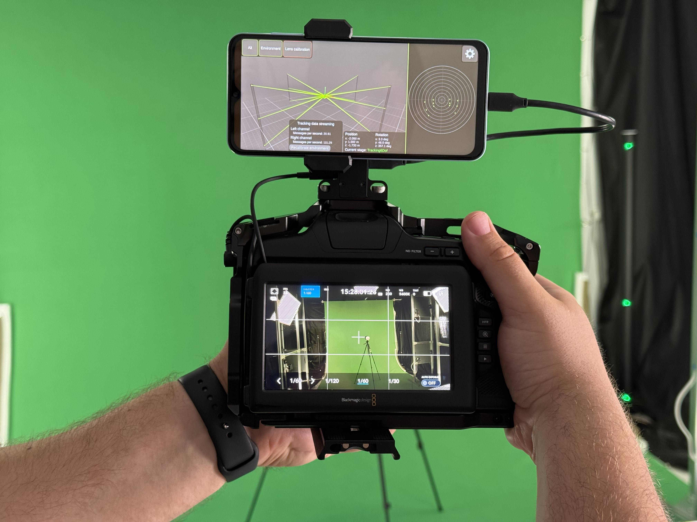
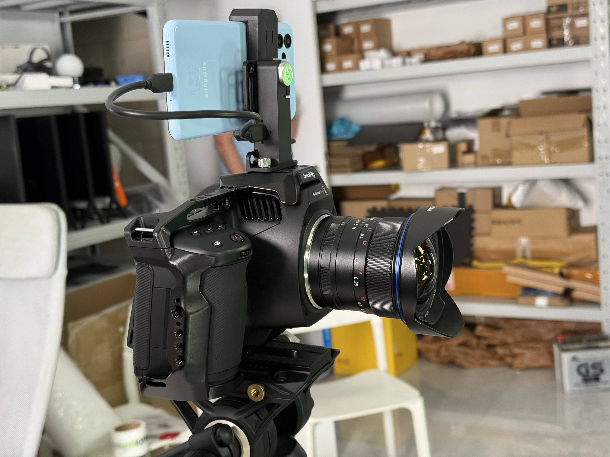

#  VPApp: Camera Tracking & Lens Calibration

**VPApp** is a lightweight virtual production system that enables two core capabilities:

- **Integrated camera tracking data** – synchronizes tracking information directly with video via the audio channel, producing what is called a **Tracked Video**.
- **Lens calibration workflow** – uses a short recording of Tracked Video to efficiently calibrate lens parameters.

#### The system includes:
- **Android app** for real-time tracking data encoding  
- **Antilatency VP Socket**, a compact hardware bridge  
- **Unreal Engine plugin** for decoding tracking in real time  

**VPApp** simplifies the virtual production pipeline by **encoding tracking data directly into the video output** — enabling **frame-accurate synchronization** and **faster calibration**, while remaining **compatible with standard video tools**.

## What is Tracked Video?

**Tracked Video** refers to any video signal — live (HDMI/SDI) or recorded — that includes **synchronized tracking data encoded in the audio channel**.

Because the tracking is encoded as audio, the video signal remains **100% standard** and fully compatible with existing video equipment and workflows, including:

- HDMI/SDI transmitters: wired and wireless  
- SD cards and recorders  
- Live video pipelines (e.g., Unreal Engine ingest)  

**No proprietary formats. Just standard video, enhanced with tracking.**

Tracked Video becomes a **self-contained virtual production (VP) asset**, equally useful for **live rendering** and **offline compositing**.

### Native Synchronization

- **Tracking data is encoded into the audio track.**
- Since professional cameras maintain a **stable and predictable offset** between video and audio streams, synchronization is **deterministic and stable**.
- By measuring this fixed offset once, you can **consistently retrieve frame-accurate tracking data** from the Tracked Video.
- **No need for genlock, timecode matching, or additional sync steps.**

## How It Works

#### 1. Tracking Data Collection  
Antilatency tracker sends real-time positional data via **VP Socket** to the **VPApp**, running on an Android device connected to the VP Socket.

#### 2. Audio Encoding  
The **VPApp encodes tracking data** into an audio signal.

#### 3. Injection into Camera  
The encoded audio is sent back through the **VP Socket into the camera’s audio input**, producing a **Tracked Video**.

#### 4. Output  
The camera outputs a **standard video signal** — either live via **HDMI/SDI**, or **recorded with tracking audio** on the SD card.
