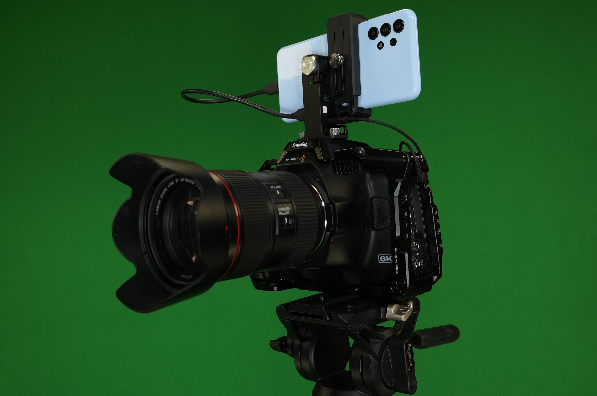

#  VPApp: Camera Tracking & Lens Calibration

**VPApp** is a lightweight virtual production system that enables two core capabilities:

- **Integrated camera tracking data** – synchronizes tracking information directly with video via the audio channel, producing what is called a **Tracked Video**.
- **Lens calibration workflow** – uses a short recording of Tracked Video to efficiently calibrate lens parameters.

#### The system includes:
- **Android app** for real-time tracking data encoding  
- **Antilatency VP Socket**, a compact hardware bridge  
- **Unreal Engine plugin** for decoding tracking in real time  

**VPApp** simplifies the virtual production pipeline by **encoding tracking data directly into the video output** — enabling **frame-accurate synchronization** and **faster calibration**, while remaining **compatible with standard video tools**.

